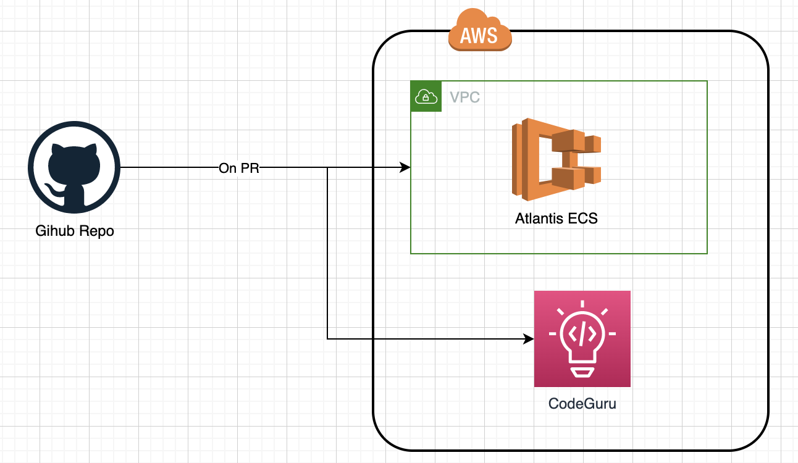

# sample-cicd-app
Sample app for cicd demonstration

# Description
This repo demonstrates the use of atlantis, infracost and aws codeguru. 

Atlantis is an application for automating Terraform via pull requests. It is deployed as a standalone application into your infrastructure.

Atlantis listens for GitHub webhooks about Terraform pull requests. It then runs terraform plan and comments with the output back on the pull request.

Infracost shows cloud cost estimates for Terraform. It lets DevOps, SRE and engineers see a cost breakdown and understand costs before making changes, either in the pull requests. This provides your team with a safety net as people can discuss costs as part of the workflow.

Amazon CodeGuru Reviewer is a service that uses program analysis and machine learning to detect potential defects that are difficult for developers to find and offers suggestions for improving your Java and Python code.

# Architecture
